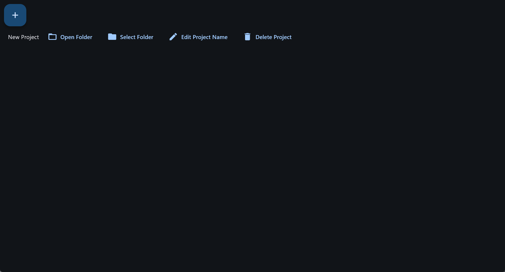

# **Sexy Projects Management Tools**
## 简介
本工具旨在更好管理项目，可对项目相关的多个文件夹进行快捷打开和管理，并整合项目待办、未来目标、长期计划、在项目之中专注的时间等

## Why Sexy
因为某游戏引擎叫做SexyAppFramework，故得名

## 警告
**当前版本暂未完成数据的本地存储，请勿用于实际工作中**

## 演示

## 项目说明
本项目采用python的Flet框架开发

页面采用路由模式进行管理

## 运行本项目
**暂无发行版**

Step 1: 创建虚拟环境、安装依赖
```bash
python -m venv venv
source venv/bin/activate #Linux/Mac
venv\Scripts\activate #Windows
pip install -r requirements.txt
```

Step 2: 运行项目
```bash
python main.py
```